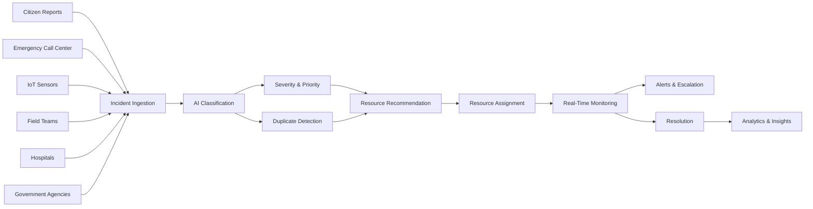
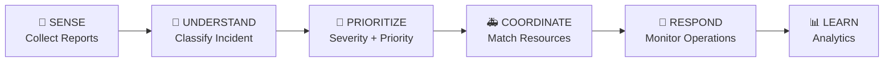
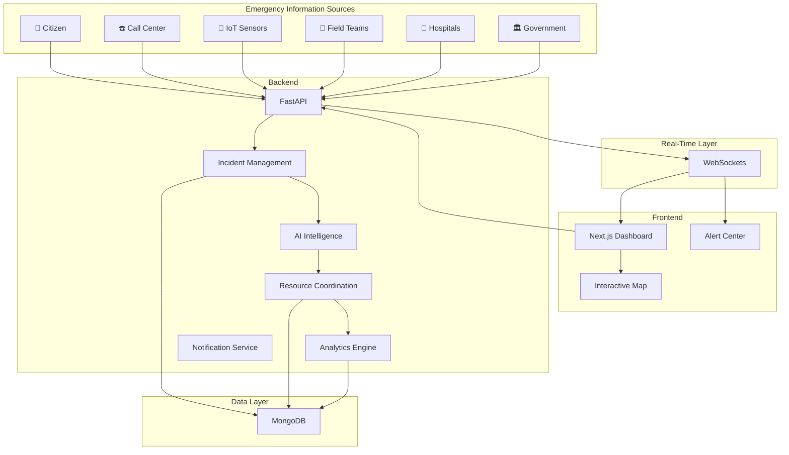
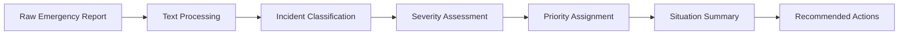
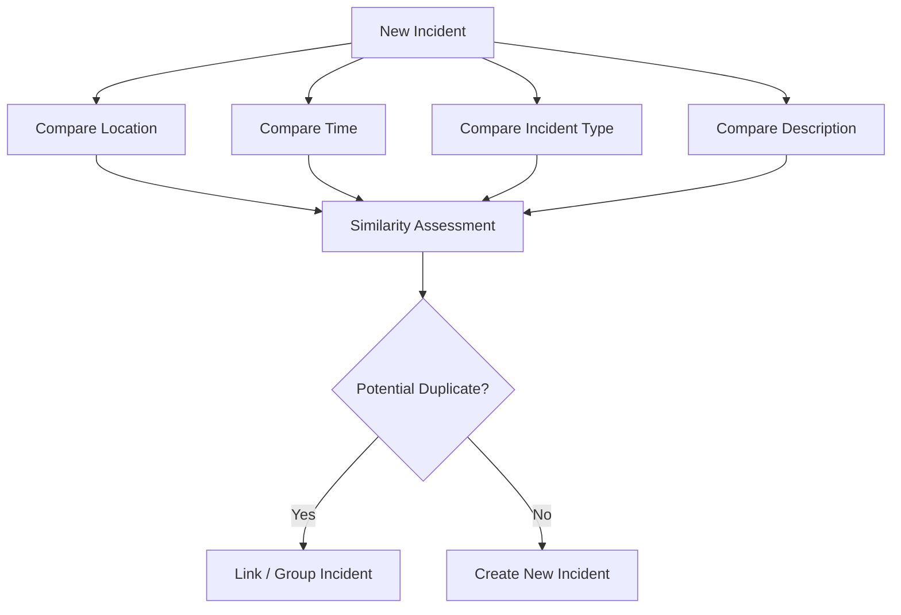
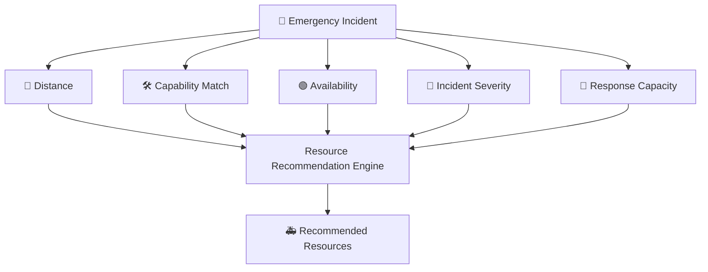
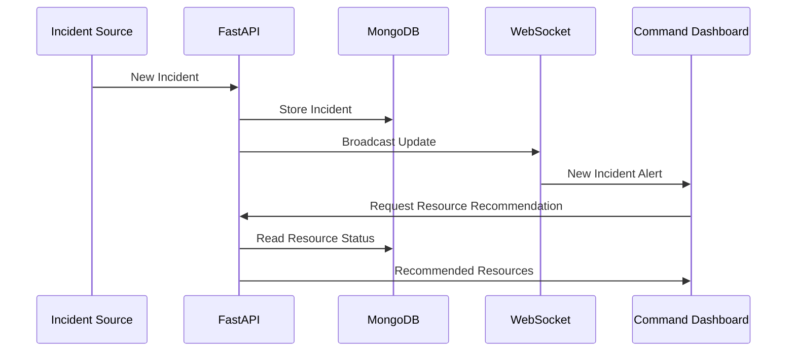
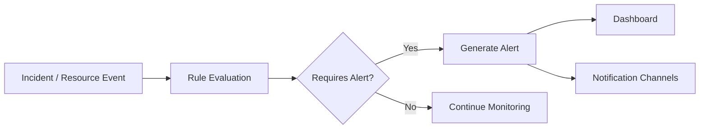
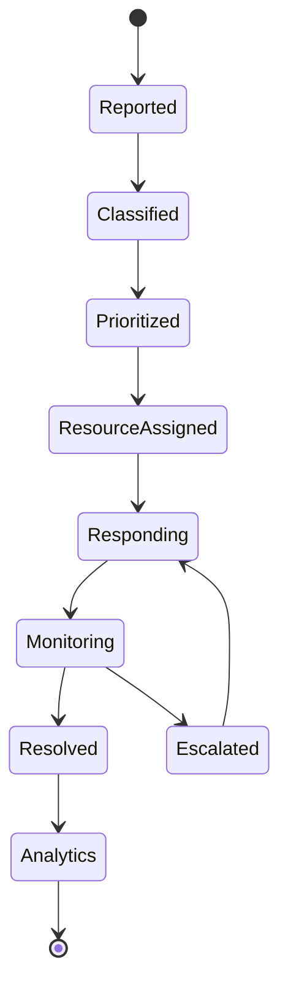
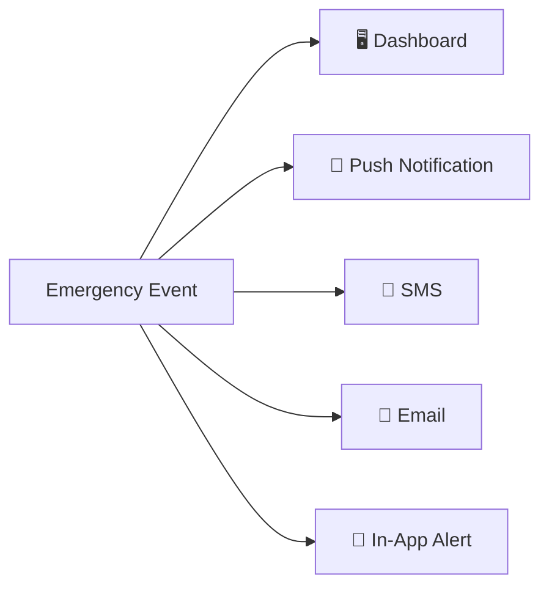

<<<<<<< HEAD
# ResQAI 🚨
> **Intelligent Emergency Response & Resource Coordination Platform**

[](https://fastapi.tiangolo.com)
[](https://nextjs.org)
[](https://www.mongodb.com)
[](https://opensource.org/licenses/MIT)

ResQAI is a real-time, unified emergency management and dispatch coordination platform. Engineered for emergency operations centers (EOCs), 911 dispatchers, and first responders, ResQAI combines **AI-assisted incident triage**, **adaptive 3-signal duplicate detection**, **geospatial multi-criteria resource matching**, and **sub-second WebSocket synchronization** to accelerate emergency response times and eliminate dispatch fragmentation.

---

## ⚠️ Important Medical & Emergency Dispatch Disclaimer

> **DISCLAIMER**: ResQAI is an intelligent decision-support system designed to assist human dispatchers and emergency operations coordinators. AI-generated incident classifications, severity scores, and dispatch recommendations are **decision-support suggestions** and **must never replace the judgment, protocols, or operational decisions of trained emergency personnel, medical professionals, or incident commanders.**

---

## 📌 Table of Contents
1. [Problem Statement](#-problem-statement)
2. [Problem Background](#-problem-background)
3. [The ResQAI Solution](#-the-resqai-solution)
4. [Key Features](#-key-features)
5. [System Architecture](#-system-architecture)
6. [Technology Stack](#-technology-stack)
7. [MongoDB Architecture](#-mongodb-architecture)
8. [AI Architecture & Offline Fallback](#-ai-architecture--offline-fallback)
9. [Adaptive 3-Signal Duplicate Detection](#-adaptive-3-signal-duplicate-detection)
10. [Multi-Criteria Resource Recommendation Algorithm](#-multi-criteria-resource-recommendation-algorithm)
11. [Real-Time WebSocket Architecture](#-real-time-websocket-architecture)
12. [Screenshots](#-screenshots)
13. [Demo Video](#-demo-video)
14. [Live Deployment](#-live-deployment)
15. [Installation & Setup](#-installation--setup)
    - [Prerequisites](#prerequisites)
    - [Environment Variables](#environment-variables)
    - [MongoDB Setup & Indexing](#mongodb-setup--indexing)
    - [Database Seeding](#database-seeding)
    - [Backend Setup](#backend-setup)
    - [Frontend Setup](#frontend-setup)
16. [Running the Project](#-running-the-project)
17. [API Documentation](#-api-documentation)
18. [3-Minute Demo Instructions](#-3-minute-demo-instructions)
19. [Team Members](#-team-members)
20. [Future Scope](#-future-scope)

---

## ❗ Problem Statement
During major emergencies (urban fires, multi-vehicle expressway collisions, industrial chemical spills, floods), emergency call centers experience an immediate flood of chaotic, unstructured reports from citizens, IoT alarms, and radio feeds. 

Dispatchers face critical bottlenecks:
- **Triage Delay**: High cognitive overhead in reading raw text descriptions, determining incident urgency, and formulating immediate Standard Operating Procedures (SOPs).
- **Duplicate Overload & Alert Fatigue**: Dozens of citizens calling about the same incident create duplicate tickets, fragmenting responder visibility and wasting precious dispatch capacity.
- **Suboptimal Fleet Routing**: Dispatchers lack dynamic matching that factors in vehicle travel distance, specialized onboard capabilities, and crew readiness.
- **Fragmented Situational Awareness**: Lack of instant, bi-directional telemetry synchronization across dispatchers, hospital trauma bays, and field teams.

---

## 📖 Problem Background
In high-density metropolitan and industrial corridors (such as Ahmedabad-Sanand GIDC, Bengaluru Tech Corridor, Mumbai Expressways), emergency response latency is often measured in minutes that dictate casualty survival rates. When an incident occurs:
- 70% of inbound calls within the first 15 minutes describe the same incident using varying citizen vocabulary.
- Manual cross-referencing of street intersections delays unit deployment by 4 to 8 minutes.
- Dispatching units without checking required capabilities (e.g. sending a standard patrol car to a chemical fire requiring hydraulic extrication or foam suppression) causes secondary dispatch delays.

---

## 💡 The ResQAI Solution
ResQAI transforms emergency command operations into an automated, data-driven workflow:
1. **Instant AI Triage**: Ingests citizen/IoT text and outputs structured severity (`CRITICAL`, `HIGH`, `MEDIUM`, `LOW`), priority (`P1`-`P4`), and immediate SOP checklists.
2. **Deterministic Offline Fallback**: Zero-dependency local heuristic engine ensures 100% triage uptime even if third-party LLM APIs fail.
3. **Adaptive 3-Signal Deduplication**: Spatio-temporal and NLP cosine similarity automatically flags and merges duplicate reports into a unified master timeline.
4. **Weighted Multi-Criteria Resource Matching**: Scores response units based on proximity (50%), capability match (30%), and fleet readiness (20%).
5. **Real-Time WebSocket Bus**: Synchronizes all cartographic map markers, active incident queues, and KPI analytics instantly across all connected screens.

---

## ✨ Key Features

- 🚨 **Centralized Emergency Command Dashboard**: Unified triage feed with live incident metrics, quick actions, and status badges.
- 📋 **Incident Management (`/incidents`)**: Filter by severity, priority, status, source, and search keywords with full audit timelines.
- 🚑 **Fleet & Resource Coordination (`/resources`)**: Real-time status tracker (`AVAILABLE`, `BUSY`, `EN_ROUTE`, `MAINTENANCE`) and instant one-click assignment/release.
- 🗺 **Interactive Map Cartography (`/map`)**: Full-screen geospatial map with custom responder and incident markers powered by Leaflet.
- 📊 **Real-Time KPI Analytics (`/analytics`)**: MongoDB aggregation dashboards for response time SLA compliance, severity breakdowns, and hotspot analytics.
- 🧪 **Disaster Scenario Simulator (`/simulation`)**: Multi-step simulation engine supporting 5 realistic crisis scenarios with duplicate burst injection.
- ⏱ **Dedicated 3-Minute Judge Demo (`/demo`)**: 13-step automated interactive walkthrough of the entire emergency lifecycle.
- 🔒 **Lightweight Role-Based Access Control (`/login`)**: JWT authentication with 5 pre-configured roles (`ADMIN`, `DISPATCHER`, `FIELD_TEAM`, `HOSPITAL`, `VIEWER`).

---

## 🏗 System Architecture

```
[ Citizen Calls / IoT Sensors / Field Teams ]
                     │
                     ▼
    ┌──────────────────────────────────┐
    │     FastAPI Gateway (:8000)      │
    │  - Pydantic v2 Schema Validation │
    │  - JWT Bearer Authentication     │
    │  - Sanitized Error Handling      │
    └────────────────┬─────────────────┘
                     │
         ┌───────────┴───────────┐
         ▼                       ▼
┌──────────────────┐   ┌────────────────────────┐
│  AI Triage &     │   │  Adaptive 3-Signal     │
│  Classification  │   │  Deduplication Engine  │
│  - Severity      │   │  - Spatial Proximity   │
│  - Priority      │   │  - Temporal Window     │
│  - SOP Actions   │   │  - TF-IDF Cosine Sim   │
└────────┬─────────┘   └───────────┬────────────┘
         │                         │
         └───────────┬─────────────┘
                     ▼
       ┌───────────────────────────┐
       │   Resource Matcher Engine │
       │   - Distance Score (50%)  │
       │   - Capability Match (30%)│
       │   - Fleet Readiness (20%) │
       └─────────────┬─────────────┘
                     │
                     ▼
       ┌───────────────────────────┐
       │      MongoDB Datastore    │
       │   - GeoJSON 2dsphere      │
       │   - Compound Status Index │
       │   - Motor Async Driver    │
       └─────────────┬─────────────┘
                     │
                     ▼
       ┌───────────────────────────┐
       │ WebSocket Event Bus /ws   │
       │  - Broadcast State Changes│
       │  - Real-time Notifications│
       └─────────────┬─────────────┘
                     │
                     ▼
       ┌───────────────────────────┐
       │ Next.js 15 Command Center │
       │  - Leaflet Map Cartography│
       │  - Recharts Analytics     │
       │  - Real-time Incident Feed│
       └───────────────────────────┘
```

---

## 🛠 Technology Stack

### Backend
- **Framework**: FastAPI (Python 3.11+)
- **Async Database Driver**: Motor (AsyncIOMotorClient)
- **Validation**: Pydantic v2 / Pydantic-Settings
- **Real-Time Gateway**: WebSockets (native async broadcast bus)
- **Security & Auth**: PyJWT, Passlib with Bcrypt

### Frontend
- **Framework**: Next.js 15 (App Router, Turbopack)
- **Language**: TypeScript & React 19
- **Styling**: Tailwind CSS & Lucide React
- **Geospatial UI**: Leaflet & React-Leaflet (OpenStreetMap)
- **Visualizations**: Recharts data visualization library

### Database & Storage
- **Database**: **MongoDB ONLY** (Atlas or local instance) with GeoJSON `Point` coordinates and `2dsphere` spatial indexing.

---

## 🗄 MongoDB Architecture

ResQAI is built natively and exclusively on MongoDB. All entities leverage flexible BSON documents and spatial indexing:

### Key Collections & Indexes
1. **`incidents`**: Emergency incident records with GeoJSON coordinates.
   - Index: `{"location": "2dsphere"}`
   - Index: `{"status": 1, "reported_at": -1}`
   - Index: `{"incident_id": 1}` (unique)
2. **`resources`**: Response fleet units (fire engines, ambulances, rescue boats, hazmat).
   - Index: `{"location": "2dsphere"}`
   - Index: `{"status": 1, "category": 1}`
   - Index: `{"resource_id": 1}` (unique)
3. **`hospitals`**: Trauma centers and emergency room bed capacities.
   - Index: `{"location": "2dsphere"}`
4. **`users`**: Dispatchers and command personnel.
   - Index: `{"email": 1}` (unique), `{"user_id": 1}` (unique)
5. **`notifications`**: Real-time alerts and escalation logs.
   - Index: `{"created_at": -1, "read": 1}`

---

## 🧠 AI Architecture & Offline Fallback

ResQAI employs a resilient multi-tier intelligence pipeline:
- **Primary AI Triage**: Analyzes caller descriptions using LLMs (Gemini / OpenAI API compatible) to extract incident taxonomy (`fire`, `flood`, `road_accident`, `medical_emergency`, `gas_leak`, `industrial_hazard`, `building_collapse`, `earthquake`), severity, and priority.
- **Immediate Action Generator**: Generates actionable, step-by-step Standard Operating Procedures (e.g. chemical containment, cordon perimeter, triage bay designation).
- **Deterministic Offline Rule Provider**: If external API keys are omitted or network connectivity is severed, a local heuristic engine evaluates keyword vector matrices to guarantee **100% zero-downtime triage**.

---

## 🔍 Adaptive 3-Signal Duplicate Detection

To prevent call center paralysis during mass disaster events, ResQAI evaluates 3 concurrent signals for every incoming report:

$$\text{Confidence} = (w_1 \cdot S_{\text{geo}}) + (w_2 \cdot S_{\text{time}}) + (w_3 \cdot S_{\text{nlp}})$$

1. **Geographic Proximity ($S_{\text{geo}}$)**: Haversine distance between coordinates. Distance $\le 1.0\text{ km}$ triggers proximity match. High-density weighting applied within $250\text{ m}$.
2. **Temporal Window ($S_{\text{time}}$)**: Delta between report timestamps. Incidents within a $45\text{-minute}$ rolling window are considered active candidates.
3. **NLP Semantic Text Similarity ($S_{\text{nlp}}$)**: Custom lightweight tokenizer with stop-word elimination and suffix stemming computing TF-IDF cosine similarity.

**Automatic Merge**: When confidence exceeds $80\%$, the incoming report is automatically merged into the master incident, updating citizen call tallies and timeline logs without creating duplicate tickets.

---

## 🎯 Multi-Criteria Resource Recommendation Algorithm

ResQAI ranks emergency response units dynamically using a multi-criteria scoring algorithm:

$$\text{Final Score} = (S_{\text{distance}} \times 0.50) + (S_{\text{capability}} \times 0.30) + (S_{\text{readiness}} \times 0.20)$$

- **Distance Score ($S_{\text{distance}}$)**: Linear decay based on travel distance: $\max(0.0, 1.0 - \frac{\text{dist\_km}}{50.0})$.
- **Capability Match ($S_{\text{capability}}$)**: Validates category and onboard equipment (e.g. `HYDRAULIC_CUTTERS`, `ICU_TRANSPORT`, `HAZMAT_SUITS`, `SCBA`, `LIFE_JACKETS`).
- **Readiness ($S_{\text{readiness}}$)**: Operational status (`AVAILABLE` = 1.0, `EN_ROUTE` = 0.5, `BUSY` = 0.0).

---

## ⚡ Real-Time WebSocket Architecture

ResQAI connects frontend interfaces directly to the backend event bus via `/ws/dashboard`:
- **Broadcast Events**: `INCIDENT_CREATED`, `INCIDENT_UPDATED`, `INCIDENT_CLASSIFIED`, `INCIDENT_DUPLICATED`, `RESOURCE_ASSIGNED`, `RESOURCE_RELEASED`, `INCIDENT_ESCALATED`, `RESOURCE_SHORTAGE`, `NOTIFICATION_CREATED`.
- **Client Synchronization**: React hook `useRealtimeEvents` updates UI state, markers, and metrics instantaneously without full page reloads.

---

## 📸 Screenshots

| Incident Management (`/incidents`) | Spatial Cartography (`/map`) |
|:---:|:---:|
|  |  |

| Analytics Dashboard (`/analytics`) | Dedicated Judge Demo (`/demo`) |
|:---:|:---:|
|  |  |

*(Screenshots can be added to `docs/images/`)*

---

## 🎥 Demo Video
- **Walkthrough Video**: [Watch ResQAI Demo on YouTube](https://youtube.com) *(Add link to hackathon submission recording)*

---

## 🌐 Live Deployment
- **Production Deployment Guide**: [docs/deployment_guide.md](docs/deployment_guide.md)
- **Frontend Dashboard**: [https://resqai-demo.vercel.app](https://resqai-demo.vercel.app) *(Or local: http://localhost:3000)*
- **Backend API Gateway**: [http://localhost:8000/api](http://localhost:8000/api)
- **Interactive Swagger Documentation**: [http://localhost:8000/docs](http://localhost:8000/docs)

---

## 📦 Installation & Setup

### Prerequisites
- Python 3.11+
- Node.js 18+ and npm
- MongoDB (Local instance on `localhost:27017` or MongoDB Atlas URI)

### Environment Variables
Copy `.env.example` to `.env` in the root folder:
```bash
cp .env.example .env
```

Key configuration options:
```env
# MongoDB Datastore
MONGODB_URI=mongodb://localhost:27017
MONGODB_DATABASE=resqai

# Server Configuration
HOST=0.0.0.0
PORT=8000
DEBUG=True
CORS_ORIGINS=http://localhost:3000,http://127.0.0.1:3000

# Optional AI API Key (Falls back to offline rule provider if empty)
AI_API_KEY=
AI_MODEL=gpt-4o-mini

# Frontend Public Endpoints
NEXT_PUBLIC_API_URL=http://localhost:8000/api
NEXT_PUBLIC_WS_URL=ws://localhost:8000/ws/dashboard
```

### MongoDB Setup & Indexing
ResQAI automatically verifies and builds all 8 MongoDB collections and `2dsphere` spatial indexes upon backend startup.

### Database Seeding
Seed demo users, response fleet vehicles, and hospitals:
```bash
python -m backend.app.scripts.seed_data
```

### Backend Setup
```bash
# Create and activate virtual environment
python -m venv venv
# Windows:
.\venv\Scripts\activate
# Linux/macOS:
source venv/bin/activate

# Install dependencies
pip install -r backend/requirements.txt

# Start backend server
uvicorn backend.app.main:app --host 0.0.0.0 --port 8000 --reload
```

### Frontend Setup
```bash
cd frontend
npm install
npm run dev
```

---

## 🚀 Running the Project

Once both servers are running:
1. Open your browser to **[http://localhost:3000](http://localhost:3000)**.
2. Sign in via `/login` (use the one-click **DISPATCHER** demo button).
3. Access the Live Dashboard at `/dashboard`.

---

## 📖 API Documentation

Interactive API documentation is generated automatically by FastAPI:
- **Swagger UI**: [http://localhost:8000/docs](http://localhost:8000/docs)
- **ReDoc**: [http://localhost:8000/redoc](http://localhost:8000/redoc)
- Detailed endpoint documentation is available in [docs/api.md](docs/api.md).

---

## ⏱ 3-Minute Demo Instructions

To evaluate the complete platform in under 3 minutes:
1. Navigate to **[http://localhost:3000/demo](http://localhost:3000/demo)**.
2. Click **"Start Complete 3-Minute Demo"**.
3. Watch ResQAI execute the 13-step emergency lifecycle:
   - Ingests critical road accident report.
   - AI classifies severity (`CRITICAL`) and priority (`P1`).
   - Recommends nearest hydraulic extrication and ambulance units.
   - Ingests secondary citizen report and detects duplicate via 3-Signal NLP/Geo match.
   - Merges duplicate into master timeline and broadcasts WebSocket updates.
   - Resolves incident and refreshes real-time analytics aggregation.

For the complete guide, see [docs/demo.md](docs/demo.md).

---

## 👥 Team Members

- **Tirth Patel** — *Full-Stack Architecture, AI Triage & Backend Engineering*
- **Contributors** — *ResQAI Open Source Community*

---

## 🔮 Future Scope

- 🛰 **Satellite SAR Imagery Integration**: Ingesting high-resolution synthetic aperture radar for flood inundation mapping.
- 📱 **Offline P2P Mesh Network Relay**: Enabling first responders in disconnected disaster zones to sync telemetry over local Bluetooth/LoRa mesh.
- 🚁 **Autonomous Drone Telemetry Ingestion**: Automated thermal imaging stream analysis for survivors trapped in multi-story building fires.
- 🌐 **Multilingual Voice-to-Text Triage**: Real-time translation and transcription for regional citizen emergency hotlines.
=======
# 🚨 ResQAI

## Intelligent Emergency Response & Resource Coordination Platform

<p align="center">

**From fragmented emergency reports to intelligent, coordinated response — in real time.**

</p>

<p align="center">


</p>

---

## 📌 Table of Contents

* [Overview](#-overview)
* [Problem Statement](#-problem-statement)
* [Why ResQAI](#-why-resqai)
* [Key Features](#-key-features)
* [System Workflow](#-system-workflow)
* [System Architecture](#-system-architecture)
* [AI Intelligence](#-ai-intelligence)
* [Duplicate Incident Detection](#-duplicate-incident-detection)
* [Intelligent Resource Coordination](#-intelligent-resource-coordination)
* [Real-Time Command Center](#-real-time-command-center)
* [Alerts and Escalation](#-alerts-and-escalation)
* [Analytics](#-analytics)
* [Technology Stack](#-technology-stack)
* [Project Structure](#-project-structure)
* [Database Design](#-database-design)
* [API Overview](#-api-overview)
* [Real-Time Communication](#-real-time-communication)
* [Demo Scenario](#-demo-scenario)
* [Installation](#-installation)
* [Environment Variables](#-environment-variables)
* [Running the Project](#-running-the-project)
* [Testing](#-testing)
* [Future Scope](#-future-scope)
* [Project Benefits](#-project-benefits)
* [Limitations](#-limitations)
* [Hackathon Deliverables](#-hackathon-deliverables)
* [Contributing](#-contributing)
* [License](#-license)

---

# 🚨 Overview

**ResQAI** is an intelligent emergency response and resource coordination platform designed to help emergency management teams transform fragmented incident information into coordinated, real-time response actions.

Emergency information can originate from multiple sources:

* 👥 Citizens
* ☎️ Emergency call centers
* 📡 IoT sensors
* 🚒 Field response teams
* 🏥 Hospitals
* 🏛️ Government agencies

ResQAI brings these sources into a centralized system where incidents can be:

1. Collected
2. Classified using AI
3. Assigned a severity level
4. Prioritized
5. Checked for duplicates
6. Matched with suitable resources
7. Monitored in real time
8. Escalated when required
9. Analyzed after resolution

The platform combines **AI, geospatial information, real-time communication, resource management, and analytics** into a single emergency command environment.

---

# 🎯 Problem Statement

Emergency response operations often involve information coming from multiple independent channels.

This can create several operational challenges:

| Challenge                     | Problem                                                                |
| ----------------------------- | ---------------------------------------------------------------------- |
| Information fragmentation     | Incident information is distributed across different sources           |
| Incident overload             | Multiple reports may describe the same emergency                       |
| Manual prioritization         | Operators may need to manually determine severity and priority         |
| Resource coordination         | Finding the right available team or vehicle can take time              |
| Limited situational awareness | Decision-makers may lack a unified real-time view                      |
| Delayed escalation            | Critical incidents or resource shortages may not be identified quickly |
| Historical analysis           | Emergency data may be difficult to analyze centrally                   |

### The Core Question

> **How can emergency organizations convert incoming incident information into intelligent, prioritized, coordinated, and real-time response decisions?**

---

# 💡 Why ResQAI?

ResQAI follows a simple operational philosophy:

```text
SENSE
  ↓
UNDERSTAND
  ↓
PRIORITIZE
  ↓
COORDINATE
  ↓
RESPOND
  ↓
LEARN
```

Instead of treating an emergency report as an isolated record, ResQAI treats it as part of a complete response lifecycle.

---

# ✨ Key Features

## 1. Multi-Source Incident Intake

ResQAI supports emergency information from:

* Citizen reports
* Emergency call centers
* IoT/sensor systems
* Field response teams
* Hospitals
* Government agencies

---

## 2. AI Incident Classification

AI analyzes incoming reports and identifies:

* Emergency type
* Severity
* Priority
* Situation summary
* Suggested immediate actions

### Severity Levels

| Level       | Meaning                               |
| ----------- | ------------------------------------- |
| 🟢 Low      | Limited impact; routine response      |
| 🟡 Medium   | Requires coordinated response         |
| 🟠 High     | Significant risk or impact            |
| 🔴 Critical | Immediate emergency response required |

---

## 3. Duplicate Incident Detection

Multiple people or systems may report the same incident.

ResQAI compares reports using:

* 📍 Location
* ⏱️ Time
* 🚨 Incident type
* 📝 Description similarity

Potential duplicates can be grouped to reduce unnecessary dispatches and provide a clearer incident picture.

---

## 4. Intelligent Resource Recommendation

The platform recommends suitable resources based on:

* Resource availability
* Distance
* Emergency severity
* Resource capability
* Response capacity
* Current operational status

Possible resources include:

* 🚑 Ambulances
* 🚒 Fire and rescue teams
* 👮 Police teams
* 🚧 Disaster response teams
* 🚗 Emergency vehicles
* 🧰 Specialized equipment
* 🏥 Medical facilities

---

## 5. Real-Time Command Dashboard

Emergency operators can monitor:

* Active incidents
* Incident locations
* Severity
* Assigned teams
* Resource availability
* Response progress
* Alerts
* Escalations
* Regional emergency patterns

---

## 6. Real-Time Alerts

The platform can generate alerts for:

* 🔴 Critical incidents
* ⏰ Delayed responses
* ⚠️ Resource shortages
* 📈 Escalating incidents
* 🚨 High-priority emergencies

---

## 7. AI-Assisted Decision Support

ResQAI can assist operators with:

* Incident summaries
* Situation assessments
* Recommended response actions
* Resource suggestions
* Operational insights

The AI acts as a **decision-support layer**, while operational decisions remain with authorized emergency personnel.

---

## 8. Emergency Analytics

Historical and operational data can be analyzed for:

* Emergency types
* Geographic distribution
* Response times
* Resource utilization
* Resource shortages
* Frequently affected locations
* Incident trends

---

# 🔄 System Workflow



---

# 🧠 SENSE → UNDERSTAND → PRIORITIZE → COORDINATE → RESPOND → LEARN



This workflow represents the core operating model of ResQAI.

---

# 🏗️ System Architecture



---

# 🧠 AI Intelligence

The AI layer is responsible for converting unstructured emergency information into structured operational information.

### Example Input

> "Large fire with heavy smoke reported near an industrial area. Several people may be trapped."

### AI Output

```text
Emergency Type : Industrial Fire
Severity       : Critical
Priority       : P1

Summary:
Large fire reported in an industrial area with possible trapped
individuals and significant smoke.

Suggested Actions:
1. Dispatch fire and rescue resources.
2. Assess potential trapped persons.
3. Request medical support.
4. Consider police/traffic control.
5. Monitor incident escalation.
```

### AI Processing Pipeline



The exact AI model can be changed independently from the rest of the system.

---

# 🔎 Duplicate Incident Detection

A single emergency can generate multiple reports.

For example:

```text
Report A
Fire reported near Industrial Area Gate 2

Report B
Heavy smoke and fire seen near Industrial Area

Report C
Possible industrial fire close to Gate 2
```

ResQAI evaluates multiple attributes:



### Benefits

* Reduces duplicate incident records
* Avoids unnecessary resource dispatches
* Improves incident visibility
* Helps operators understand the complete report picture

---

# 🚑 Intelligent Resource Coordination

ResQAI maintains information about emergency resources and their operational status.

### Resource Categories

| Category             | Examples                         |
| -------------------- | -------------------------------- |
| 🚑 Medical           | Ambulances, medical teams        |
| 🚒 Fire & Rescue     | Fire engines, rescue teams       |
| 👮 Police            | Police teams, traffic control    |
| 🚧 Disaster Response | Disaster response teams          |
| 🧰 Equipment         | Specialized emergency equipment  |
| 🏥 Facilities        | Hospitals and medical facilities |

---

## Resource Recommendation Factors



### Illustrative Example

For a critical road accident:

| Resource    | Distance | Capability                 | Status    |
| ----------- | -------: | -------------------------- | --------- |
| Ambulance A |   1.8 km | Medical emergency          | Available |
| Police B    |   2.4 km | Traffic & incident control | Available |
| Rescue C    |   3.1 km | Rescue operations          | Available |

> **Note:** These values are illustrative demo data and should not be presented as measured real-world performance.

---

# 🖥️ Real-Time Command Center

The command center provides a centralized operational view.

### Dashboard Components

```text
┌─────────────────────────────────────────────────────────────┐
│                    RESQAI COMMAND CENTER                   │
├─────────────────────────────────────────────────────────────┤
│                                                             │
│  ACTIVE INCIDENTS      CRITICAL       RESOURCES AVAILABLE  │
│       ● 24                ● 4                ● 31          │
│                                                             │
├──────────────────────────────┬──────────────────────────────┤
│                              │                              │
│        LIVE MAP              │       INCIDENT FEED          │
│                              │                              │
│   🔴 Critical                │ 🔴 Industrial Fire           │
│   🟠 High                    │ 🟠 Road Accident             │
│   🟡 Medium                  │ 🟡 Medical Emergency         │
│   🟢 Low                     │                              │
│                              │                              │
├──────────────────────────────┼──────────────────────────────┤
│                              │                              │
│     RESOURCE STATUS          │       ALERT CENTER           │
│                              │                              │
│ 🚑 Available                 │ 🔴 Critical Incident         │
│ 🚒 Deployed                  │ ⚠️ Resource Shortage        │
│ 👮 Available                 │ ⏱️ Response Delay            │
│ 🚧 Maintenance               │                              │
│                              │                              │
└──────────────────────────────┴──────────────────────────────┘
```

The actual frontend can represent this concept using a modern dark command-center interface.

---

# 🗺️ Interactive Emergency Map

The map provides geographical situational awareness.

### Map Information

* Incident locations
* Severity indicators
* Assigned resources
* Emergency facilities
* Resource positions
* Affected areas

Suggested mapping technologies:

* OpenStreetMap
* Leaflet
* MapLibre

---

# ⚡ Real-Time Updates

ResQAI uses **WebSockets** to deliver real-time operational changes.

Example:



This allows operators to see important changes without continuously refreshing the dashboard.

---

# 🚨 Alerts and Escalation

ResQAI identifies operational conditions that may require attention.

### Alert Types

| Alert                | Example                                         |
| -------------------- | ----------------------------------------------- |
| 🔴 Critical Incident | Critical emergency received                     |
| ⏱️ Delayed Response  | Response has exceeded configured threshold      |
| ⚠️ Resource Shortage | Required resource type has limited availability |
| 📈 Escalation        | Incident severity increases                     |
| 🚨 Operational Alert | Important command-center event                  |

### Alert Flow



---

# 📊 Analytics

The analytics module converts operational data into useful insights.

### Analytics Areas

```text
Emergency Types
      │
      ├── Fire
      ├── Road Accident
      ├── Medical
      ├── Natural Disaster
      └── Other
       
Geographic Distribution
      │
      ├── High Incident Areas
      ├── Affected Locations
      └── Regional Patterns

Response Operations
      │
      ├── Response Times
      ├── Incident Status
      └── Resolution Patterns

Resource Utilization
      │
      ├── Available
      ├── Assigned
      ├── Deployed
      └── Maintenance

Resource Shortages
      │
      ├── Resource Type
      ├── Location
      └── Demand Patterns
```

---

# 🧩 Technology Stack

| Layer         | Technology                  |
| ------------- | --------------------------- |
| Frontend      | Next.js                     |
| UI            | Tailwind CSS                |
| Backend       | FastAPI                     |
| Database      | MongoDB                     |
| AI / NLP      | Python-based AI/NLP layer   |
| Maps          | OpenStreetMap               |
| Mapping UI    | Leaflet / MapLibre          |
| Real-Time     | WebSockets                  |
| Data          | Synthetic emergency data    |
| Notifications | Email / SMS / Push / In-app |

---

# 🗂️ Suggested Project Structure

```text
resqai/
│
├── frontend/
│   ├── app/
│   ├── components/
│   ├── dashboard/
│   ├── incidents/
│   ├── resources/
│   ├── map/
│   ├── alerts/
│   └── analytics/
│
├── backend/
│   ├── app/
│   │   ├── main.py
│   │   ├── routes/
│   │   ├── models/
│   │   ├── services/
│   │   ├── ai/
│   │   ├── resources/
│   │   ├── alerts/
│   │   └── analytics/
│   │
│   └── requirements.txt
│
├── data/
│   ├── incidents/
│   ├── resources/
│   └── facilities/
│
├── docs/
│   ├── architecture/
│   ├── screenshots/
│   └── diagrams/
│
├── .env.example
├── .gitignore
├── README.md
└── LICENSE
```

---

# 🍃 MongoDB Database Design

ResQAI uses MongoDB as its primary database.

The database can be organized around the following collections:

```text
resqai
│
├── incidents
├── resources
├── teams
├── facilities
├── alerts
├── notifications
└── analytics
```

---

## 🚨 Incidents Collection

Example document:

```json
{
  "incidentId": "INC-1001",
  "type": "industrial_fire",
  "description": "Large fire with heavy smoke reported",
  "severity": "critical",
  "priority": "P1",
  "status": "active",
  "location": {
    "latitude": 23.123,
    "longitude": 72.456
  },
  "source": "citizen",
  "createdAt": "2026-09-19T10:30:00Z"
}
```

---

## 🚑 Resources Collection

Example:

```json
{
  "resourceId": "AMB-001",
  "type": "ambulance",
  "status": "available",
  "capabilities": [
    "medical_emergency"
  ],
  "location": {
    "latitude": 23.125,
    "longitude": 72.451
  }
}
```

---

## 🚨 Alerts Collection

Example:

```json
{
  "alertId": "ALT-1001",
  "type": "critical_incident",
  "severity": "critical",
  "incidentId": "INC-1001",
  "message": "Critical industrial fire requires immediate response",
  "status": "active",
  "createdAt": "2026-09-19T10:32:00Z"
}
```

---

# 🔌 API Overview

The backend can expose REST APIs such as:

## Incident APIs

```text
POST   /api/incidents
GET    /api/incidents
GET    /api/incidents/{id}
PATCH  /api/incidents/{id}
DELETE /api/incidents/{id}
```

## AI APIs

```text
POST /api/ai/classify
POST /api/ai/summarize
POST /api/ai/recommend
POST /api/ai/duplicate-check
```

## Resource APIs

```text
GET   /api/resources
GET   /api/resources/available
POST  /api/resources
PATCH /api/resources/{id}
```

## Alert APIs

```text
GET   /api/alerts
POST  /api/alerts
PATCH /api/alerts/{id}
```

## Analytics APIs

```text
GET /api/analytics/overview
GET /api/analytics/incidents
GET /api/analytics/resources
GET /api/analytics/regions
```

> API paths are a suggested project structure and should match the routes implemented in the final application.

---

# 🔄 Incident Lifecycle

Every emergency can move through a defined lifecycle:



---

# 🎬 Demo Scenario

## Scenario: Critical Road Accident

### Step 1 — Incident Report

A citizen reports:

```text
"Major road accident near the highway intersection.
Multiple people may require medical assistance."
```

### Step 2 — AI Classification

ResQAI identifies:

```text
Type       : Road Accident
Severity   : Critical
Priority   : P1
Status     : Active
```

### Step 3 — Duplicate Detection

The system checks whether other reports describe the same accident using:

* Location
* Time
* Incident type
* Description similarity

### Step 4 — Resource Recommendation

The system identifies appropriate resources:

```text
🚑 Ambulance
👮 Police / Traffic Team
🚒 Rescue Team
```

### Step 5 — Assignment

Available resources are assigned to the incident.

### Step 6 — Live Monitoring

The command center displays:

* Incident location
* Severity
* Assigned resources
* Resource status
* Response progress

### Step 7 — Alerts

The command center receives relevant alerts if:

* The incident escalates
* Response is delayed
* Resources become unavailable
* Additional support is required

### Step 8 — Resolution

Once the incident is resolved, the system stores the operational data for analytics.

---

# 🧪 Example End-to-End Flow

```text
Citizen Report
      ↓
Incident Created
      ↓
AI Classification
      ↓
Severity = Critical
      ↓
Priority = P1
      ↓
Duplicate Check
      ↓
Resource Recommendation
      ↓
Ambulance + Police + Rescue
      ↓
Assignment
      ↓
Real-Time Tracking
      ↓
Alert / Escalation if Required
      ↓
Incident Resolution
      ↓
Analytics
```

---

# 🛠️ Installation

## Prerequisites

Make sure the following are installed:

* Node.js
* Python
* MongoDB
* Git

---

## Clone the Repository

```bash
git clone <YOUR_GITHUB_REPOSITORY_URL>
cd resqai
```

---

# 💻 Backend Setup

Navigate to the backend:

```bash
cd backend
```

Create a virtual environment:

```bash
python -m venv venv
```

Activate it.

### Windows

```bash
venv\Scripts\activate
```

### Linux / macOS

```bash
source venv/bin/activate
```

Install dependencies:

```bash
pip install -r requirements.txt
```

Start the FastAPI server:

```bash
uvicorn app.main:app --reload
```

Backend will normally be available at:

```text
http://localhost:8000
```

---

# 🌐 Frontend Setup

Navigate to the frontend:

```bash
cd frontend
```

Install dependencies:

```bash
npm install
```

Start the development server:

```bash
npm run dev
```

Frontend will normally be available at:

```text
http://localhost:3000
```

---

# 🍃 MongoDB Setup

Create a MongoDB database for ResQAI.

Example:

```text
Database:
resqai
```

Configure the connection string through the environment configuration.

Example:

```env
MONGODB_URI=mongodb://localhost:27017/resqai
```

For production deployment, use a secure MongoDB deployment and never commit credentials to GitHub.

---

# 🔐 Environment Variables

Create a `.env` file for backend configuration.

Example:

```env
MONGODB_URI=mongodb://localhost:27017/resqai

AI_API_KEY=your_ai_key

FRONTEND_URL=http://localhost:3000

WEBSOCKET_URL=ws://localhost:8000

EMAIL_HOST=
EMAIL_PORT=
EMAIL_USERNAME=
EMAIL_PASSWORD=

SMS_PROVIDER=
SMS_API_KEY=
```

> Only configure services that are actually implemented in the project.

Never commit `.env` files containing secrets.

---

# ▶️ Running the Complete System

Start MongoDB.

Then start the backend:

```bash
cd backend
uvicorn app.main:app --reload
```

Start the frontend in another terminal:

```bash
cd frontend
npm run dev
```

Open:

```text
http://localhost:3000
```

---

# 🧪 Testing

The system should be tested across the major emergency-response workflows.

### Functional Testing

* Create an incident
* Update an incident
* Change severity
* Assign resources
* Change resource status
* Resolve an incident
* Generate alerts

### AI Testing

* Incident classification
* Severity classification
* Priority generation
* Summary generation
* Duplicate detection
* Suggested response actions

### Real-Time Testing

* New incident appears on dashboard
* Resource status changes update live
* Alerts appear without page refresh
* Incident assignments are synchronized

### Map Testing

* Incident markers appear correctly
* Severity is visually distinguishable
* Resource locations are displayed
* Map updates reflect current operational information

---

# 📈 Example Dashboard Metrics

The dashboard can display operational metrics such as:

```text
┌─────────────────────────────────────────┐
│           RESQAI OVERVIEW               │
├─────────────────────────────────────────┤
│                                         │
│ Active Incidents          24             │
│ Critical Incidents         4             │
│ Available Resources       31             │
│ Assigned Resources        18             │
│ Active Alerts              6             │
│                                         │
└─────────────────────────────────────────┘
```

> These numbers are example UI data only and should be replaced with live database values in the application.

---

# 📱 Notification Channels

Depending on implementation, ResQAI can support:



Notifications can be triggered according to incident severity, escalation rules, resource conditions, or operational events.

---

# 🌍 Data Sources

The project can use a combination of synthetic and publicly available data sources.

### Emergency Data

* Synthetic emergency incidents
* Simulated sensor events
* Historical disaster datasets where appropriate

### Geographic Data

* OpenStreetMap
* Map-based geographic information

### Facilities

* Public hospital information
* Emergency facilities

### Environmental Context

* Weather information
* Simulated environmental sensor data

For the hackathon demonstration, synthetic data can be used to create a controlled and repeatable emergency scenario.

---

# 🔮 Future Scope

ResQAI can be extended beyond the hackathon prototype.

## Advanced AI

* Multimodal incident understanding
* Image-based emergency assessment
* Voice-to-incident conversion
* Predictive emergency analysis
* More advanced duplicate detection

## Smart City Integration

* Traffic systems
* CCTV systems
* Smart infrastructure
* IoT networks
* Public safety systems

## Advanced Resource Optimization

* Dynamic routing
* Multi-resource optimization
* Cross-agency coordination
* Resource demand forecasting

## Communication

* Automated multilingual notifications
* Voice alerts
* Citizen communication
* Emergency operator assistance

## Geographic Intelligence

* Emergency heat maps
* Risk zones
* Historical incident patterns
* Dynamic affected-area visualization

---

# 🎯 Project Benefits

ResQAI is designed around five major operational improvements:

| Capability                      | Purpose                                     |
| ------------------------------- | ------------------------------------------- |
| Centralized incident management | Bring emergency information into one system |
| AI-assisted understanding       | Convert reports into structured information |
| Intelligent coordination        | Connect incidents with suitable resources   |
| Real-time visibility            | Provide a live command-center view          |
| Analytics                       | Support operational and historical insights |

---

# 🔐 Security Considerations

A production deployment would require additional security controls, including:

* Authentication
* Role-based access control
* API authorization
* Secure secrets management
* Encryption
* Audit logs
* Data retention policies
* Access monitoring
* Secure communication

Emergency systems should be designed with strong reliability, privacy, security, and availability requirements.

---

# ⚠️ Limitations

The hackathon version of ResQAI is a prototype.

Potential limitations include:

* Synthetic or limited emergency data
* Simulated resource availability
* Prototype AI classification
* Limited real-world integrations
* Demonstration-level notification systems
* Geographic accuracy depending on available data
* Real-world deployment would require validation and integration with authorized emergency agencies

The platform should therefore be considered **decision-support software**, not a replacement for trained emergency personnel or official emergency procedures.

---

# 🏆 Hackathon Demo Flow

For a short live demonstration, use the following sequence:

```text
01 ── Open Command Center
        ↓
02 ── Show Live Emergency Map
        ↓
03 ── Create Road Accident
        ↓
04 ── AI Classifies Incident
        ↓
05 ── Severity → Critical
        ↓
06 ── Duplicate Detection
        ↓
07 ── Resource Recommendation
        ↓
08 ── Assign Ambulance + Police + Rescue
        ↓
09 ── Show Live Dashboard Update
        ↓
10 ── Trigger Critical Alert
        ↓
11 ── Update Response Status
        ↓
12 ── Resolve Incident
        ↓
13 ── Show Analytics
```

---

# 🖼️ Recommended README Visuals

For the final GitHub repository, place screenshots in:

```text
docs/
└── screenshots/
    ├── dashboard.png
    ├── incident-details.png
    ├── resource-management.png
    ├── emergency-map.png
    ├── alerts.png
    └── analytics.png
```

Then display them in the README:

```markdown
## 🖥️ Command Center


## 🗺️ Emergency Map


## 🚑 Resource Coordination


## 📊 Analytics


```

---

# 🎥 Demo Video

Add the final hackathon demonstration video here:

```markdown
## 🎥 Demo

[▶️ Watch the ResQAI Demo](YOUR_VIDEO_LINK)
```

The demonstration should show the complete journey from **incident creation → AI analysis → resource recommendation → assignment → real-time monitoring → resolution**.

---

# 🌐 Live Demo

If a deployed version is available:

```markdown
## 🌐 Live Demo

[🚀 Launch ResQAI](YOUR_LIVE_DEMO_URL)
```

If deployment is not available, remove this section rather than adding a placeholder link.

---

# 📊 Project Presentation

The project presentation covers:

1. Problem
2. Challenges
3. ResQAI solution
4. AI intelligence
5. Resource coordination
6. Real-time command center
7. Demonstration and future scope

---

# 🤝 Team Contribution

Recommended contribution areas:

| Area          | Responsibility                                     |
| ------------- | -------------------------------------------------- |
| Frontend      | Dashboard, map, UI components                      |
| Backend       | APIs, business logic                               |
| AI            | Classification, summarization, duplicate detection |
| Database      | MongoDB schemas and queries                        |
| Real-Time     | WebSockets and event updates                       |
| Integration   | Maps, notifications, external data                 |
| Testing       | Workflow and system validation                     |
| Documentation | README, presentation, demo                         |

All team members should contribute through the project's public GitHub repository as required by the hackathon workflow.

---

# 🌱 Contributing

Contributions are welcome.

### Development Flow

```bash
git checkout -b feature/your-feature
```

Make your changes, test them, and commit:

```bash
git add .
git commit -m "Add incident classification workflow"
```

Push the branch:

```bash
git push origin feature/your-feature
```

Then create a pull request.

---

# 📌 Git Commit Guidelines

Use meaningful commits such as:

```text
feat: add incident management
feat: implement AI classification
feat: add duplicate detection
feat: implement resource recommendation
feat: add real-time dashboard
feat: add emergency map
feat: implement alert system
feat: add analytics dashboard
fix: resolve incident status update
docs: improve project documentation
```

Avoid vague commits such as:

```text
update
changes
final
final2
working
test
```

---

# 📄 License

Add the project's chosen license here.

Example:

```text
This project is developed as a hackathon prototype.
```

If an open-source license is selected, include the complete license text or a separate `LICENSE` file.

---

# 🚨 ResQAI at a Glance

```text
                 ┌──────────────────────────┐
                 │       EMERGENCY DATA     │
                 │                          │
                 │ 👥 ☎️ 📡 🚒 🏥 🏛️       │
                 └────────────┬─────────────┘
                              │
                              ▼
                 ┌──────────────────────────┐
                 │      🧠 AI ENGINE        │
                 │                          │
                 │ Classification           │
                 │ Severity                  │
                 │ Priority                  │
                 │ Duplicate Detection      │
                 │ Situation Summary        │
                 └────────────┬─────────────┘
                              │
                              ▼
                 ┌──────────────────────────┐
                 │   🚑 RESOURCE ENGINE     │
                 │                          │
                 │ Distance                 │
                 │ Capability              │
                 │ Availability             │
                 │ Response Capacity        │
                 └────────────┬─────────────┘
                              │
                              ▼
                 ┌──────────────────────────┐
                 │   🖥️ COMMAND CENTER      │
                 │                          │
                 │ Live Map                 │
                 │ Incidents                │
                 │ Resources                │
                 │ Alerts                   │
                 │ Analytics                │
                 └────────────┬─────────────┘
                              │
                              ▼
                 ┌──────────────────────────┐
                 │     🚨 RESPONSE          │
                 │                          │
                 │ Assign → Monitor →       │
                 │ Escalate → Resolve      │
                 └──────────────────────────┘
```

---

# 🧠 Core Philosophy

> **SENSE. UNDERSTAND. COORDINATE. RESPOND.**

ResQAI brings emergency information, AI-assisted understanding, intelligent resource coordination, and real-time operational visibility into one unified platform.

The goal is to provide emergency teams with a clearer picture of **what is happening, how serious it is, what resources are available, and what action can be coordinated next.**

---

<p align="center">

## 🚨 RESQAI

### Intelligent Emergency Response & Resource Coordination

**SENSE → UNDERSTAND → PRIORITIZE → COORDINATE → RESPOND → LEARN**

</p>
>>>>>>> 94a5af5aa6b8992d721325daea50cd4966300000
